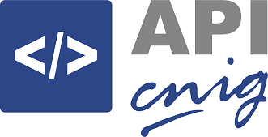
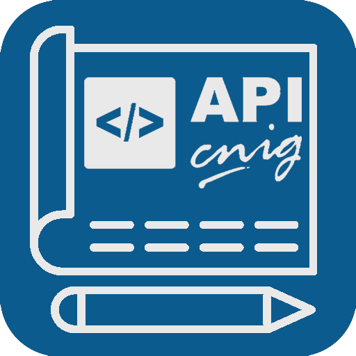
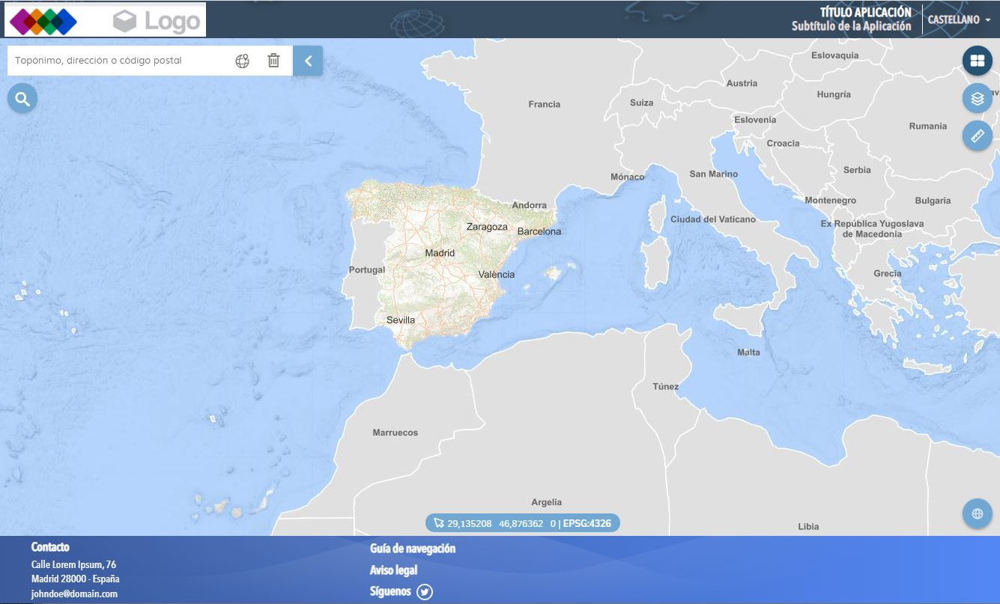

<p align="center">
  
  
</p>
<h1 align="center"><strong>APICNIG</strong> - <small>Arquetipo React 16</small></h1>

<p align="center">
  <a title="GNU GPL v3" href="LICENSE.md">
    
  </a>
  <a title="Node version" href="#">
    
  </a>  
  <a title="NPM version" href="#">
    
  </a>
  <a title="Language" href="https://www.w3schools.com/html/" target="_blank">
    
  </a>  
  <a title="Language" href="https://www.w3schools.com/js/" target="_blank">
    
  </a>
  <a title="Language" href="https://www.w3schools.com/css/" target="_blank">
    
  </a> 
  <a title="Library" href="https://componentes.cnig.es/api-core/test.html" target="_blank">
    
  </a>   
</p>

## Descripción 👷

El objeto de este proyecto es disponer de una [single-page application (SPA), o aplicación de página única](https://es.wikipedia.org/wiki/Single-page_application), muy básica, que haga uso de los componentes de la API-CNIG y sirva como base a aplicaciones más complejas.

<p align="center">
  
</p>


El propósito de una **SPA** es la de disponer de una aplicación web o sitio web que quepa en una sola página con el propósito de dar una experiencia más fluida a los usuarios, como si fuera una aplicación de escritorio. En una SPA todos los códigos de HTML, JavaScript, y CSS se cargan una sola vez o los recursos necesarios se cargan dinámicamente cuando lo requiera la página, normalmente como respuesta a las acciones del usuario.



La aplicación se compone de un layout formado por un header, lienzo con cartografía y footer. Se han cargado algunos componentes muy básicos y algunos plugin para mostrar en qué ficheros del código se configuran cada una de las herramientas.

La aplicación dispone de soporte mutiidioma  utilizando los componentes de [react-i18next](https://react.i18next.com/).

Además viene activa el arranque en una vista definida por parámetros. Podemos centrar el mapa de arranque en un lugar, especificando centro, sistema de referencia y nivel de zoom de la siguiente manera

```bash
http://localhost:3000?zoom=18&srs=EPSG:4083&center=563308,3104166
http://localhost:3000?zoom=18&srs=EPSG:25830&center=439836,4477460
http://localhost:3000?zoom=18&srs=EPSG:4326&center=-3.7102,40.4459
http://localhost:3000?zoom=18&srs=EPSG:3857&center=-412985,4930860
```


## ⚛️ React

Como *framework* para el desarrollo de este arquetipo se ha utilizado **React**. Se trata de una biblioteca Javascript de código abierto diseñada para crear interfaces de usuario con el objetivo de facilitar el desarrollo de aplicaciones en una sola página. Es mantenido por Facebook y la comunidad de software libre.

Se ha utilizado la versión de React 16. Esta es la versión utilizada en otros visualizadores como [Iberpix](https://www.ign.es/iberpix/visor/) o [Fototeca](https://fototeca.cnig.es/fototeca/).

### Creación del proyecto.

Este proyecto se ha creado usando el comando **npx** del gestor de paquetes de Node.JS

```bash
$ npx create-react-app
```

Toda la estructura, incluido el repo por defecto o el package.json, se crea automáticamente sin hacer más. Para más información sobre esto ver los [Apuntes de desarrollo](develnotes.md).


### Available Scripts

El package.json viene con los siguientes scripts:

### `npm start`

Lanza la App en modo de desarrollo en un servidor propio con autoreload cuando varían cosas.\
Podemos verlo en [http://localhost:3000](http://localhost:3000) con el *browser*.

La página se recarga con los cambios.\
Podemos comprobar los errores por consola.

### `npm run build`

Realiza un *build* de la App para producción en la carpeta `build` folder.\
Para más información, consultar [deployment](https://facebook.github.io/create-react-app/docs/deployment).

### `npm run eject`

create-react-app encapsula todos los módulos npm que está usando internamente, por lo que su package.json será muy limpio y simple sin que tenga que preocuparse por ello.

Sin embargo, si desea comenzar a hacer cosas más complejas e instalar módulos que puedan interactuar con los módulos que create-react-app está usando bajo el capó, esos nuevos módulos necesitan saber qué está disponible y qué no, lo que significa que debe tener create-react -app anular el resumen de ellos.

Eso, en esencia, es lo que react-scripts ejecthace. Dejará de ocultar lo que tiene instalado debajo del capó y en su lugar expulsará esas cosas en el package.json de su proyecto para que todos lo vean.

## 🚀 Despliegue

https://projects.develmap.com/apicnig/arquetipor16/

## ⛲️ Referencias

* [Apuntes de desarrollo](develnotes.md)
* [Extensiones de Visual Studio Code para trabajar con React](https://code.visualstudio.com/docs/nodejs/reactjs-tutorial)

### 🔸 More info

You can learn more in the [Create React App documentation](https://facebook.github.io/create-react-app/docs/getting-started).

To learn React, check out the [React documentation](https://reactjs.org/).

### Code Splitting

This section has moved here: [https://facebook.github.io/create-react-app/docs/code-splitting](https://facebook.github.io/create-react-app/docs/code-splitting)

### Analyzing the Bundle Size

This section has moved here: [https://facebook.github.io/create-react-app/docs/analyzing-the-bundle-size](https://facebook.github.io/create-react-app/docs/analyzing-the-bundle-size)

### Making a Progressive Web App

This section has moved here: [https://facebook.github.io/create-react-app/docs/making-a-progressive-web-app](https://facebook.github.io/create-react-app/docs/making-a-progressive-web-app)

### Advanced Configuration

This section has moved here: [https://facebook.github.io/create-react-app/docs/advanced-configuration](https://facebook.github.io/create-react-app/docs/advanced-configuration)

### Deployment

This section has moved here: [https://facebook.github.io/create-react-app/docs/deployment](https://facebook.github.io/create-react-app/docs/deployment)

### `npm run build` fails to minify

This section has moved here: [https://facebook.github.io/create-react-app/docs/troubleshooting#npm-run-build-fails-to-minify](https://facebook.github.io/create-react-app/docs/troubleshooting#npm-run-build-fails-to-minify)