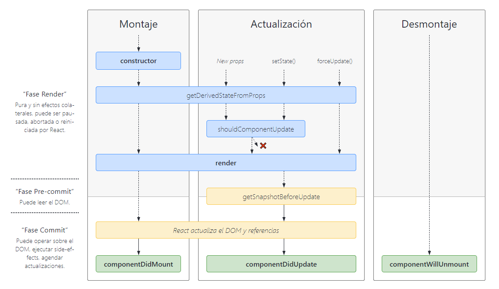

# Apuntes de desarrollo

## 🧬️ Ciclo de vida del React.Component / *React lifecycle diagram*



`componentDidMount()` se invoca inmediatamente después de que un componente se monte (se inserte en el árbol). La inicialización que requiere nodos DOM debería ir aquí. Si necesita cargar datos desde un punto final remoto, este es un buen lugar para instanciar la solicitud de red.

Este método es un buen lugar para establecer cualquier suscripción. Si lo haces, no nos olvidemos de darlo de baja en `componentWillUnmount()`.


## 🧩️ Snippets
### 🔸 Acceso a fichero de la carpeta **public**
En ocasiones resulta útil disponer en la carpeta de despliegue de ficheros javascript con configuraciones o json con datos, de manera que podamos cambiar el comportamiento de la aplicación sin necesidad de volver a trasnspilarla en desarrollo. Por ejemplo, en este proyecto necesitamos dos ficheros en los que configuramos, por un lado las rutas a las ayudas de la App, por otro los servicios a los que se puede accder desde el FullTOC

```javascript
// appconfig.js: guarda las URLS con las rutas de los ficheros de Ayuda en diversos idiomas.

const HELP_PAGES = {
  url_help_es: 'http://visores-cnig-gestion-publico.desarrollo.guadaltel.es/visualizador/help_es.html',
  url_help_en: 'http://visores-cnig-gestion-publico.desarrollo.guadaltel.es/visualizador/help_en.html',
};
```

Para acceder a estos ficheros, desde el index.html tenemos que llamarlos usando %PUBLIC_URL%:

```html
<script type="text/javascript" src="%PUBLIC_URL%/toc.js"></script>
<script type="text/javascript" src="%PUBLIC_URL%/appconfig.js"></script>
```

Para acceder a su contenido, declaramos la variable desde el componente de la siguiente forma:

```javascript
declare var PRECHARGED_LYRLIST; //e2m: con esto accedemos a la const de toc.js
declare var HELP_PAGES; //e2m: con esto accedemos a la const de appconfig.js
```

## 🧪️ Pruebas en desarrollo

Permalink con coordenadas en Web Mercator

https://projects.develmap.com/apicnig/arquetipor16?zoom=18&srs=EPSG:3857&center=-412985,4930860

Permalink con coordenadas en Latitud y Longitud

https://projects.develmap.com/apicnig/arquetipor16?zoom=18&srs=EPSG:4326&center=-3.7102,40.4459

Permalink con coordenadas en ETRS89 UTM XY Huso 30

https://projects.develmap.com/apicnig/arquetipor16?zoom=18&srs=EPSG:25830&center=439836,4477460

Permalink con coordenadas en REGCAN95 UTM XY Huso 28

https://projects.develmap.com/apicnig/arquetipor16?zoom=18&srs=EPSG:4083&center=563308,3104166

